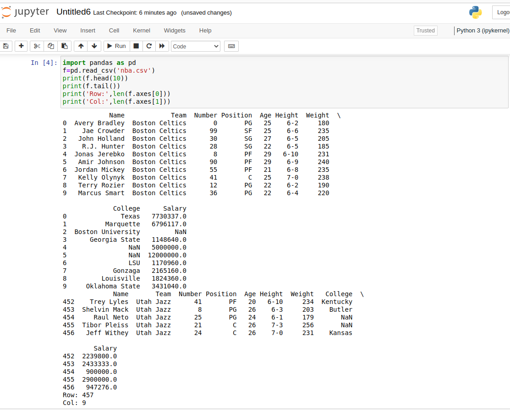

# command-line-arguments-to-count-word
## AIM:
To write a python program for getting the word count from the contents of a file using command line arguments.
## EQUIPEMENT'S REQUIRED: 
PC
Anaconda - Python 3.7
## ALGORITHM: 
### Step 1:
 Import pandas as pd.
### Step 2: 
 Read the CSV file using read_csv method.
### Step 3: 
Use head and tail method to get the required contents from the file.
### Step 4:  
 Use len() method to get the number of rows and columns.

### Step 5: 
Print the output. 

## PROGRAM:
```
import pandas as pd
f=pd.read_csv('nba.csv')
print(f.head(10))
print(f.tail())
print('Row:',len(f.axes[0]))
print('Col:',len(f.axes[1]))
```
### OUTPUT:

## RESULT:
Thus the program is written to find the word count from the contents of a file using command line arguments.
